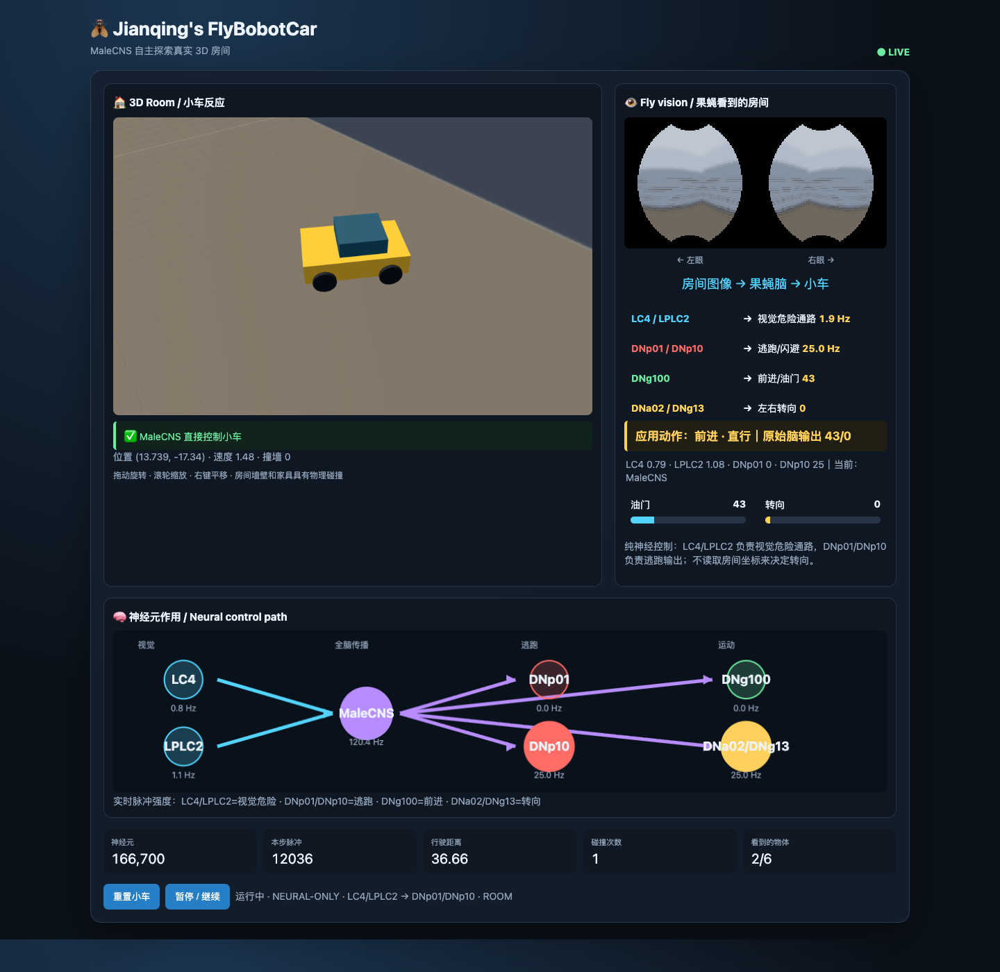

# Jianqing's FlyBobotCar

A true WebGL 3D room explored by a robot car using the MaleCNS fruit-fly model. It is both a runnable demonstration and a reference implementation for connecting MaleCNS to another simulated or physical environment.

This project is adapted from the upstream [Fly64](https://github.com/ornata/fly) experiment, which connects the MaleCNS model to Super Mario 64. FlyBobotCar replaces the game with a standalone room, furniture, vehicle physics, and Three.js viewer.



## Documentation

- [Architecture and data contracts](docs/ARCHITECTURE.md)
- [Build a new MaleCNS environment adapter](docs/BUILDING-NEW-ADAPTER.md)
- [Coding-agent instructions](AGENTS.md)
- [OpenCLI/X findings and neuron test plan](docs/TWITTER-FINDINGS.md)
- [Upstream Fly64 reference](https://github.com/ornata/fly)

```text
3D room + furniture → six-face camera → simulated compound eye
→ 166,700-neuron MaleCNS → LC4/LPLC2/DNp01 neural escape readout
→ DNg100/DNa02/DNg13 motor command → 3D robot car
```

## Requirements

- Apple Silicon macOS (the current tested platform)
- Homebrew and Git
- About 2 GB of free disk space
- Internet access for Three.js and the MaleCNS data download

## Setup and run

```bash
git clone git@github.com:pjq/FlyRobotCar.git
cd FlyRobotCar
./setup.sh       # clones Fly64, installs Python dependencies, prepares MaleCNS data
./run.sh
```

`setup.sh` downloads approximately 1.2 GB of MaleCNS source data. If you already have Fly64 prepared elsewhere, set `FLY64_DIR=/path/to/fly` instead.

Open <http://127.0.0.1:8775/>.

## Room

The bounded room is 48 × 48 world units and contains physical walls, a sofa, coffee table, dining table, bookshelf, armchair, plant, tiled floor, and a `Jianqing's FlyBobotCar` wall sign. The backend physics, fly-camera rendering, and Three.js scene use the same object layout.

## Controls

- Drag: orbit camera
- Wheel: zoom
- Right-drag: pan
- **Reset**: manually return the car to its initial position
- **Pause / Resume**: pause simulation
- **Visual avoidance reflex**: toggle the collision-avoidance layer

## Runtime architecture

The Python process owns the authoritative room, vehicle physics, sensory rendering, MaleCNS stepping, and control decisions. The browser is a Three.js viewer that receives the same furniture list and current telemetry over HTTP.

Endpoints:

| Endpoint | Purpose |
|---|---|
| `GET /state` | Vehicle pose, raw and applied controls, threats, contacts, and model metrics |
| `GET /vision` | Raw `256 × 128 × 3` RGB compound-eye preview |
| `GET /objects` | Authoritative furniture definitions used by Three.js |
| `POST /reset` | Reset vehicle pose and counters |
| `POST /pause` | Pause or resume the simulation |
| `POST /avoidance` | Enable or disable visual/tactile reflexes |

## Autonomous control

The car is now controlled by neural outputs only. There is no room-coordinate steering, road-following, geometric threat override, tactile code, stuck recovery, or automatic recentering.

The tested neural populations are:

- `DNg100` → throttle
- `DNa02` / `DNg13` → steering
- `LC4` / `LPLC2` → looming/visual danger candidates
- `DNp01` / `DNp10` → neural escape candidates

The interface reports the raw brain output, named neuron-group rates, applied command, and active source (`MaleCNS` or `MaleCNS neural escape`). The live mapping is also drawn as a neural-path diagram: `LC4/LPLC2 → MaleCNS → DNp01/DNp10` for visual escape, `DNg100 → throttle`, and `DNa02/DNg13 → steering`. Furniture and walls only produce visual input and physical collision outcomes.

Use `scripts/benchmark.py` to compare raw MaleCNS against the neural escape readout. Use the `neural-escape` endpoint only to run an ablation/control comparison; it does not add a non-neural controller.

The connectome is fixed and is not trained. The sensor encoder, neuron dynamics, output decoder, and vehicle physics are engineered approximations.

## Extend or reuse

The project is intentionally small: the environment adapter is contained in `robot.py`, and the viewer is a single `index.html`. To add furniture, extend `OBJECTS`; to connect another game or robot, preserve the observation → MaleCNS → action loop and replace the environment/actuator adapter.

See [Building a New MaleCNS Environment Adapter](docs/BUILDING-NEW-ADAPTER.md) for a minimal loop, coordinate conventions, output mappings, experiment design, physical-robot precautions, and an agent completion checklist.

## Verification

```bash
python3 -m py_compile robot.py
./run.sh
curl -fsS http://127.0.0.1:8775/state | jq
curl -fsS http://127.0.0.1:8775/objects | jq
curl -fsS http://127.0.0.1:8775/vision | wc -c
```

The vision endpoint should return exactly `98304` bytes.
